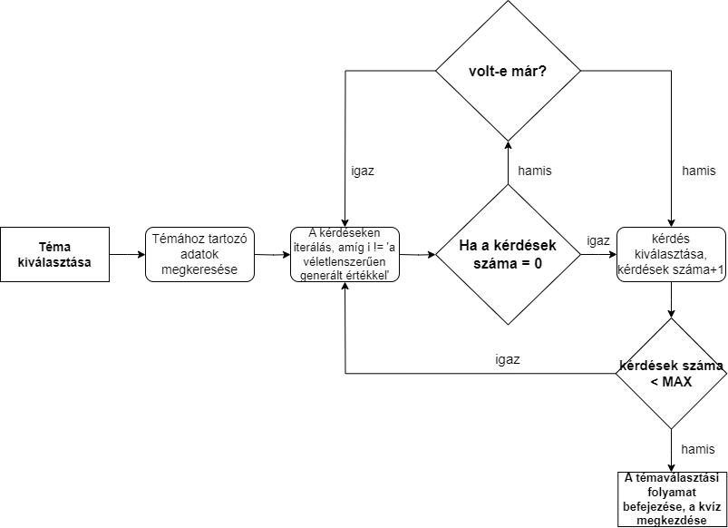
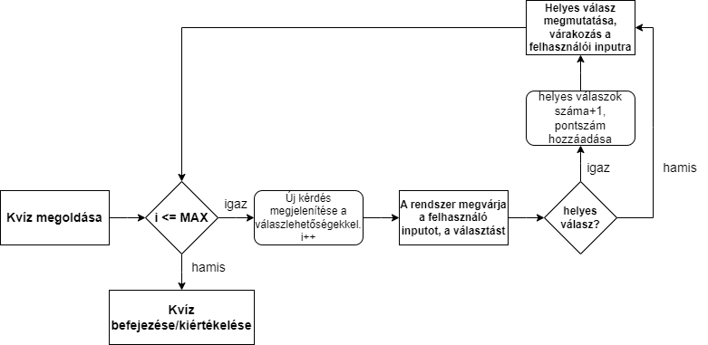

# Rendszerterv

## A rendszer célja

A rendszer célja a diákok tanulásának rásegítése egy érdekes módon ami lehetőleg jobban megmarad a fejükben,
mint ha papíron dolgozatokat, házi feladatokat, vagy egyéb tanulási módszereket használnának amik nem keltik fel ténylegesen az érdeklődésüket a tantárgy iránt.
Ennek sikere továbbá a tanárok feladatain is könnyít, hogy ne kelljen beleerőszakolni a tudást a diákok fejébe.

## Projektterv

## Üzleti folyamatok modellje

### Üzleti szereplők

**Felhasználó:** A *felhasználók*, akik a kvízeket megoldhatják.

**Fejlesztő:** A *fejlesztők* feladata:

- Probléma kezelés: Biztosítani a rendszer megfelelő, hibamentes működését.
- További témák hozzáadása: Újabb témák, illetve az azokhoz tartozó kérdések halmazával bővíteni a rendszert.
- Meglévő témák/kérdések megváltoztatása, javítása: Hibás kérdések/válaszok javítása.
- Rendszerkarbantartás

### Üzleti folyamatok

1. **A kvíz elindítása:** A felhasználó kiválasztja a kvíz témáját és megkezdi annak megoldását:
    - Bemenet: Felhasználó kiválasztja a témát.
    - Kimenet: Az választott témához kapcsolódó random kérdések és válaszlehetőségek.
    - Szereplők: Felhasználó
2. **A kvíz megoldása:** A felhasználó a kvíz megoldása során adott számú kérdésre válaszol. Egy kérdés megválaszolását követően a helyes válasz azonnal látható lesz:
    - Bemenet: A felhasználó kiválasztja, az általa helyesnek ítélt választ. Ezt követően már nincs lehetőség módosítani a választást.
    - Kimenet: A rendszer megmutatja a helyes választ. Jó válasz esetén megnöveli a pontszámot. A felhasználó átléphet a közvetkező kérdésre.
    - Szereplők: Felhasználó
3. **A kvíz kiértékelése:** A felhasználó, minden kérdés megválaszolását követően megnézheti a kvíz eredményét:
    - Bemenet: A felhasználó az utolsó kérdésen továbblépve jut el a kvíz kiértékeléséhez. A felhasználó visszatérhet a kezdőképernyőre.
    - Kimenet: A felhasználó láthatja, a helyesen megválaszolt kérdések számát, az elért pontszámot és az eltelt időt.
    - Szereplők: Felhasználó

## Követelmények

1. ### Átláthatóság

    *Leírás követelmény specifikációban: A kvíz egyértelmű legyen használat során, mindenki bármilyen ismerettség hiányában is megfelelően tudja használni a funkciókat.*

    Az összes szükséges gomb látható legyen a képernyőn.
    Ne legyenek semmivel eltakarva, ne metszék egymást, legyen megfelelő távolság közöttük.
    Egyértelműen címkézve legyenek funkcionalitásuk szerint.
    A kérdések nagyobb betűméretben jelenjenek meg a képernyőn, mint minden más.
    Kérdések, válaszok olvashatóak legyenek.

2. ### Vonzó megjelenés

    *Leírás követelmény specifikációban: Mivel a kvíz főleg gyerekek számára van tervezve nagyon fontos, hogy a weboldalnak szép kinézete legyen.*

    Színes háttér, ami válaszadáskor megváltozik helyesség szerint.
    Vizuális jelzés, ha az egered egy gomb felett van.

3. ### Kérdések véletlenszerű megjelenítése

    *Leírás követelmény specifikációban: A kérdéseknek minden indításkor véletlenszrű sorrendben kell megjelennie egymás után.*

    Minden indításkor a kérdések sorrendje legyen randomizálva.

4. ### Négy válaszlehetőség

    *Leírás követelmény specifikációban: Minden kérdéshez legyen négy lehetséges válasz amire rá lehet kattintani.*

    Minden alkalommal a négy lehetőség közül csak egy legyen helyes, a többi legyen helytelen.

5. ### Válasz helyességének jelzése

    *Leírás követelmény specifikációban: Válaszadás után meg kell jeleníteni vizuálisan, hogy az adott válasz helyes vagy helytelen volt. Például a helyes válasz zöld lesz a többi meg piros.*

    Válaszadás után a helyes válasz gombja zöldre vált, a többi pedig pirosra.
    A háttérszín helyes válasz esetén zöld, helytelen esetén piros lesz.

6. ### Következő kérdésre lépés

    *Leírás követelmény specifikációban: Válaszadás után a következő kérdésre való lépésnek a lehetőségét biztosítani kell.*

    Válaszadás után megjelenik egy tovább gomb, amelyre kattintva a következő kérdésre érsz. Ha nincs több kérdés, akkor a kvíz befejeződik.

7. ### Végeredmény megjelenítése

    *Leírás követelmény specifikációban: A kvíz végén meg kell jeleníteni hogyan teljesített a felhasználó elért pont/max pont vagy százalék formájában.*

    Ha nincs több kérdés, akkor meg kell jeleníteni az end screen-t.
    Ezen látható az elért eredmény helyes válasz/összes válasz formában.

8. ### Újrakezdés gomb

    *Leírás követelmény specifikációban: A kvíz végén vagy közben vissza lehessen lépni a kezdő állapotba.*

    A kvíz kezdése utáni bármely szakaszában biztosítani kell az újrakezdés lehetőségét. Ez lehet a kvíz közben vagy a végén az end screen-en.

9. ### Téma választása

    *Leírás követelmény specifikációban: A kvíz indítása előtt lehessen több téma közül választani, ami meghatározza milyen kérdések jelennek meg.*

    A kvíz elkezdéséhez témát is kell választani, amely befolyásolja a kérdések tárgyát.
    Sose legyen kérdés olyan témából, ami nem lett kiválasztva.

## Funkcionális terv

### Menühierarchia

1. Az alkalmazás főképernyője egy szimpla, a kvíz elindítására szolgáló menü.
2. A következő képernyő a kvíz témájának kiválasztására szolgál.
3. A téma kiválasztásával, a rendszer megkeresi az adott témához tartozó adatokat, és véletlenszerűen kiválasztja a kérdéseket, az ahhoz tartozó válaszokkal együtt.
4. Ha minden kiválasztott kérdésen végigment a rendszer, akkor befejeződik a kvíz megoldása és egy új képernyő jelenik meg, ahol a rendszer kiértékeli a kvíz megoldását és visszajelzést ad a felhasználónak.

---

### Rendszerhasználati esetek

**Az adott témához tartozó kérdések kiválasztása:** A rendszer végigmegy a témához tartózó kérdéseken, azokból véletlenszerűen kiválaszt adott számú kérdést, ehhez többször végig iterál a kérdéseken és a már kiválasztott kérdéseket eltárolja, ezzel elkerülve egy kérdés többszöri előfordulását egy kvíz megoldásában.

**Kvíz megoldás:** A kérdések kiválasztását követően megkezdődik a kvíz megoldása. Itt a rendszer megjeleníti a kérdéseket, illetve az azokhoz tartozó válaszokat. Számolja a helyes válaszokat és a pontszámot.

## Fizikai Környezet

Az alkalmazás a felhőalapú szerverekre és az internetre támaszkodik, így a felhasználók bármely modern böngésző segítségével hozzáférhetnek hozzá.
Az alábbiakban részletezem a fizikai környezet főbb elemeit:

### Szerverek

- Felhőalapú Szerverek:
Az alkalmazás szerveroldali része felhőalapú infrastruktúrán fut.
A szerverek a felhasználói kéréseket fogadják és feldolgozzák, valamint az adatbázis hozzáférést kezelik.

- Adatbázis Szerver:
Az alkalmazás adatbázisa a kérdéseket, válaszokat, témákat és eredményeket tárolja.

### Felhasználói Eszközök

- Számítógépek:
A felhasználók a kvíz kitöltéséhez számítógépeket használnak, amelyeken egy modern webböngésző fut.
Ezek a számítógépek lehetnek asztali gépek vagy hordozható laptopok.

- Okostelefonok és Táblagépek:
Az alkalmazásnak reszponzívnek kell lennie, hogy a felhasználók okostelefonokon és táblagépeken is használhassák.
Ezek az eszközök különböző méretű képernyőkkel rendelkeznek, és a weboldalnak alkalmazkodnia kell hozzájuk.

### Internetkapcsolat

Az alkalmazás működéséhez szükség van internetkapcsolatra, mivel a szerverekre való csatlakozás és az adatok lekérése online történik.
Az internetkapcsolat megbízható és gyors kell legyen annak érdekében, hogy a felhasználók zökkenőmentesen használhassák az alkalmazást.

### Operációs Rendszer

A felhasználói számítógépek különböző operációs rendszereken futnak, például Windows, macOS vagy Linux.
Az alkalmazásnak platformfüggetlennek kell lennie, és kompatibilisnek kell lennie a leggyakrabban használt böngészőkkel, például Chrome, Firefox, Safari és Edge.

### Biztonság

Az alkalmazásnak megfelelő biztonsági intézkedéseket kell tartalmaznia, hogy megvédje az adatokat és a felhasználók személyes információit.
Ez magában foglalja a biztonságos kapcsolatot (SSL), a hitelesítést, a jogosultságkezelést és a tűzfalakat.

A fizikai környezet részeként fontos megjegyezni, hogy az alkalmazás üzemeltetése során gondoskodni kell a szerverek karbantartásáról és az esetleges hibák gyors javításáról.
Az internetkapcsolat stabilitása is kulcsfontosságú, hogy a felhasználók mindig hozzáférhessenek az alkalmazáshoz.

## Absztrakt domain modell

## Architektúrális terv

## Tesztterv
